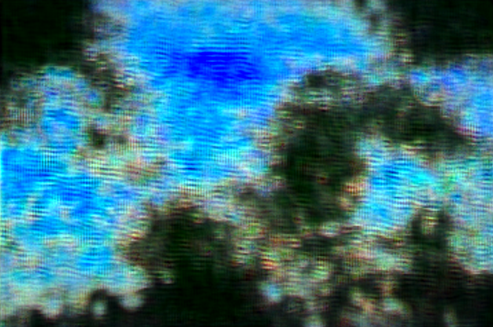

# Some NN projects

## GAN Beaches

Given dataset of over a 1000 beaches from across the globe, this gan network can generate images of new beaches, none of which previously ever existed. 

Here is a sample image:

Notice how the model learned a number of important characteristics of tropical beaches:

- Further you go away from the coast, the darker the color of water becomes. Vice versa is also true where the water near the beach is the lightest shade of blue.

- Sand generated around the coast, proportionally sound relative to water

- Coast shows some green, learning from the dataset that beaches are commonly surrounded by trees and other greenery.
