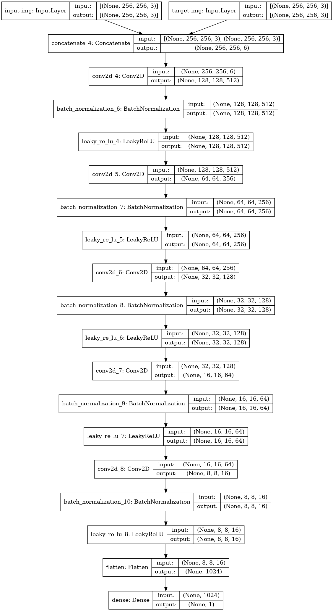

# Car State: Pix 2 Pix Image Segmentation 

https://user-images.githubusercontent.com/55261018/134445600-a3c9be78-3d52-4476-b14a-f4ab244ed777.mp4

 Bigger model with longer training could make this a lot better; this approach has a ton of potentional. Unfortunately, I only have access to a small laptop which prevents my ability to train for long periods of time + I don't have enough RAM. 

 

Tried to implement this paper from scratch with minimal outside sources to see if I could. Applied GAN pix2pix idea to "traditional" semantic image segmentation which was not done in the paper. This generative adversarial architecture makes things easier since one does not have to hand code a loss function for the generator (discriminator model much more sophisticated compared to anything any individual could probably write). My dataset was a set of 10k segmented images of cars driving in a variety of settings, made opensource by commaai. 

 

Paper: https://arxiv.org/abs/1611.07004v3
Dataset: https://github.com/commaai/comma10k

<!-- #### Status as of Sep 19, 2021 -->
<!--   -->
<!-- **Pink**: Your Car  -->
<!--   -->
<!-- **Green**: Other Car -->
<!--   -->
<!-- **Dark Brown**: Drivable Road -->
<!--   -->
<!-- **Light Brown**: Non-Drivable Area -->
<!--   -->
<!-- **Red**: Lane Lines -->
<!--   -->
# Other Details
**Generator**: Unet Architecture as implemented in [paper](https://arxiv.org/abs/1505.04597)

**Discriminator**: Need to implement PatchGan discriminator. Right now just uses simple conv net.

