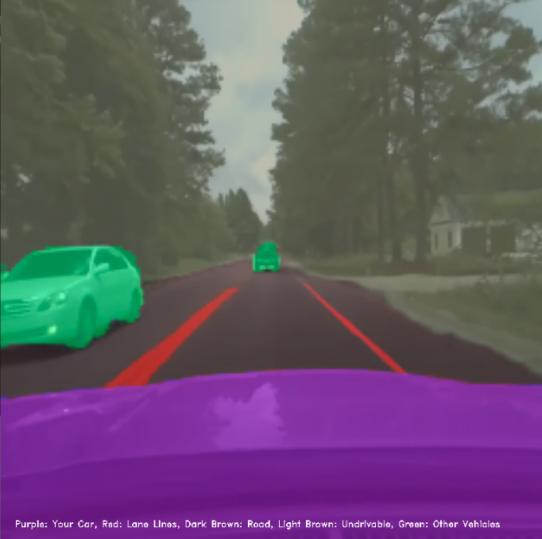
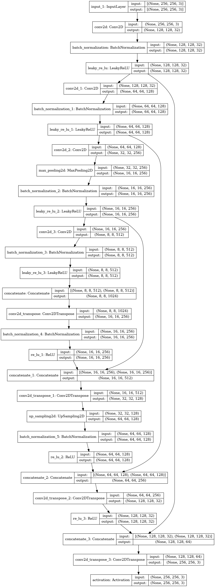
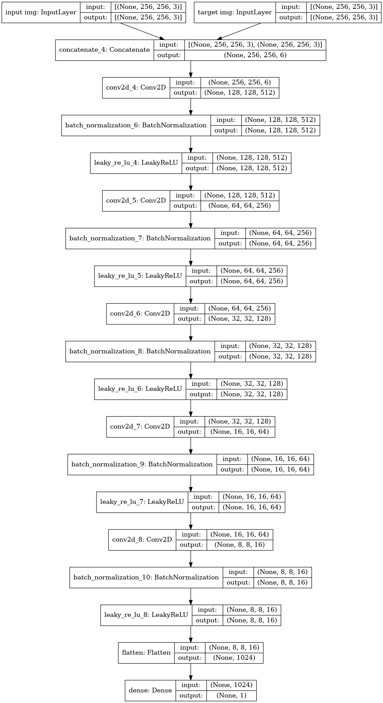

# Car State: Pix 2 Pix Image Segmentation 

 

Tried to implement this paper from scratch with minimal outside sources to see if I could. Applied GAN pix2pix idea to "traditional" semantic image segmentation which was not done in the paper. This generative adversarial architecture makes things easier since one does not have to hand code a loss function for the generator (discriminator model much more sophisticated compared to anything any individual could probably write).  

Paper: https://arxiv.org/abs/1611.07004v3
Dataset: https://github.com/commaai/comma10k

## Car on Road

Tried to see if this technique could work well for image segmentation tasks such as this one - <!-- #### Status as of Sep 19, 2021 -->
<!--   -->
<!-- **Pink**: Your Car  -->
<!--   -->
<!-- **Green**: Other Car -->
<!--   -->
<!-- **Dark Brown**: Drivable Road -->
<!--   -->
<!-- **Light Brown**: Non-Drivable Area -->
<!--   -->
<!-- **Red**: Lane Lines -->
<!--   -->
# Other Details
**Generator**: Unet Architecture as implemented in [paper](https://arxiv.org/abs/1505.04597)

**Discriminator**: Need to implement PatchGan discriminator. Right now just uses simple conv net.

