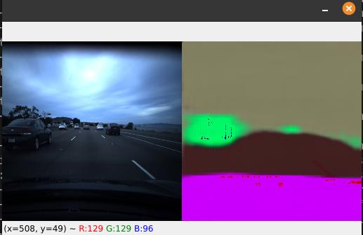
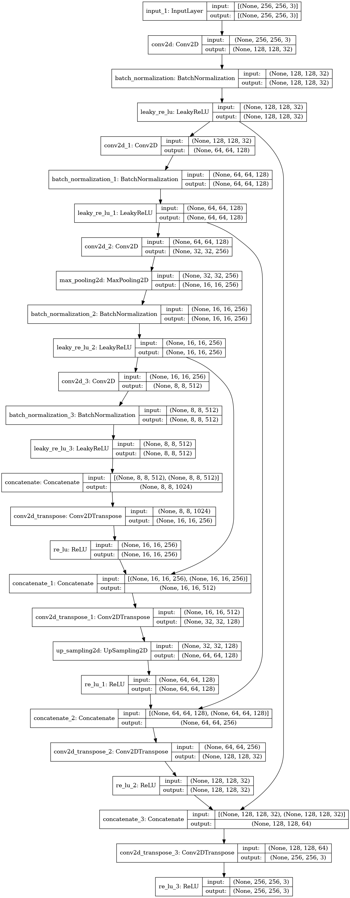
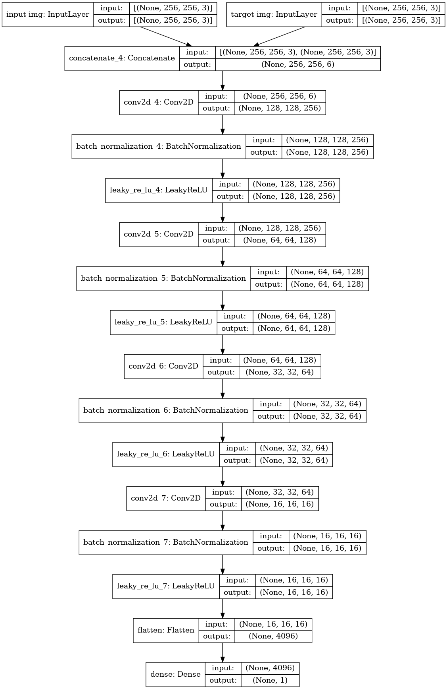

# Pix 2 Pix Image Segmentation 

## Car on Road

Tried to see if this technique could work well for image segmentation tasks such as this one - making things easier since one does not have to hand code a loss function for the generator.  

#### Status as of Sep 19, 2021
 

 
**Pink**: Your Car 
 
**Green**: Other Car
 
**Dark Brown**: Drivable Road
 
**Light Brown**: Non-Drivable Area
 
**Red**: Lane Lines - Not working yet
 

# Other Details
**Generator**: Unet Architecture as implemented in [paper](https://arxiv.org/abs/1505.04597)

**Discriminator**: Need to implement PatchGan discriminator. Right now just uses simple conv net.

